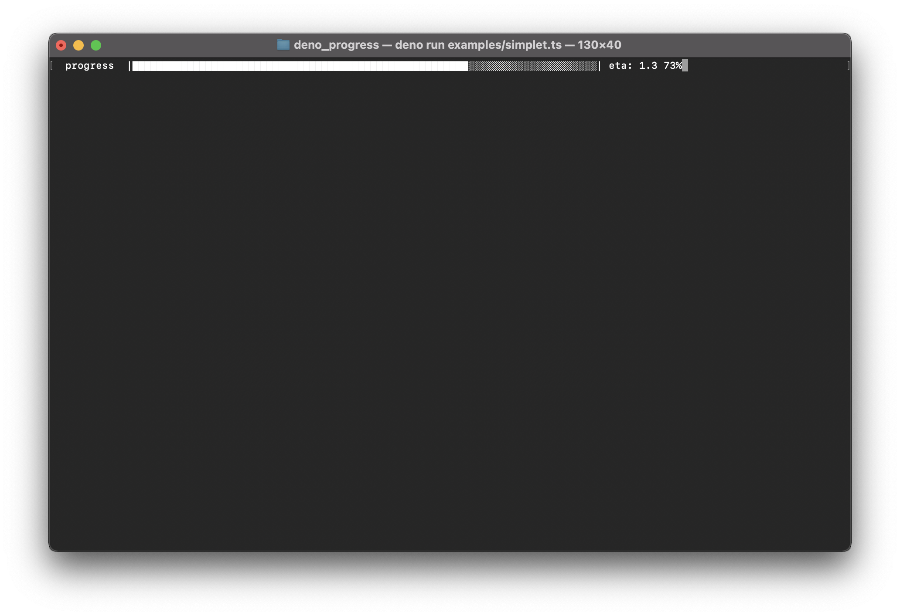

<h1 align="center">deno progress</h1>



<p align="center">

<a href="https://doc.deno.land/https/deno.land/x/deno_progress/mod.ts"></a>


</p>

## Usage

First we create a Progressbar, giving it a `fmt` string and options || total,
<br> telling it when it will be considered complete. then we will do `tick()`

```ts
import { Progressbar } from "https://deno.land/x/deno_progress@<version>/mod.ts";

const bar = new Progressbar("|:bar|", { total: 100, width: 50 });
const id = setInterval(() => {
  bar.tick(2);
  if (bar.complete === true) {
    clearInterval(id);
  }
}, 100);
```

## Options

| name             | description                                                   |
| ---------------- | ------------------------------------------------------------- |
| `curr`           | current completed index                                       |
| `total`          | total number of ticks to complete                             |
| `width`          | the displayed width of the progress bar defaulting to total   |
| `head`           | head character defaulting to complete character               |
| `complete`       | completion character defaulting to "█"                        |
| `incomplete`     | incomplete character defaulting to "░"                        |
| `renderThrottle` | minimum time between updates in milliseconds defaulting to 16 |
| `callback`       | optional function to call when the progress bar completes     |
| `clear`          | will clear the progress bar upon termination                  |

## Tokens:

| name       | description                          |
| ---------- | ------------------------------------ |
| `:bar`     | the progress bar itself              |
| `:current` | current tick number                  |
| `:total`   | total ticks                          |
| `:elapsed` | time elapsed in seconds              |
| `:percent` | completion percentage                |
| `:eta`     | estimated time of arrival in seconds |
| `:rate`    | rate of ticks per second             |

## Methods

### `tick(length, tokens)`

tick the progress bar with the given `length` and optional `tokens`

### `render(force, tokens)`

render the progress bar with optional `tokens` and optional `force`

### `interrupt(msg)`

interrupt the progress bar and write a message above it.

### `terminate()`

terminate the progress bar

## Custom Tokens

You can define custom tokens by adding

```js
{
  name:
  "value";
}
```

object parameter to `tick()` method

```ts
import { Progressbar } from "https://deno.land/x/deno_progress@<version>/mod.ts";
const bar = new Progressbar(":current: :token1 :token2", { total: 3 });
bar.tick({
  token1: "Hello",
  token2: "World!\n",
});
```

The above example would result in the result output below:

```
1: Hello World!
```

## Examples

a simple example

```ts
import { Progressbar } from "https://deno.land/x/deno_progress@<version>/mod.ts";

const bar = new Progressbar("  :title |:bar| eta: :eta :percent", {
  total: 100,
});

const id = setInterval(() => {
  bar.tick(1, { title: "progress " });
  if (bar.complete === true) {
    clearInterval(id);
  }
}, 50);
```

More examples can be found on the example folder

## Credits

Ported from [node-progress](https://github.com/visionmedia/node-progress).
Thanks for the work and inspiration!

## License

[MIT](https://github.com/Eyoatam/deno_progress/LICENSE).
